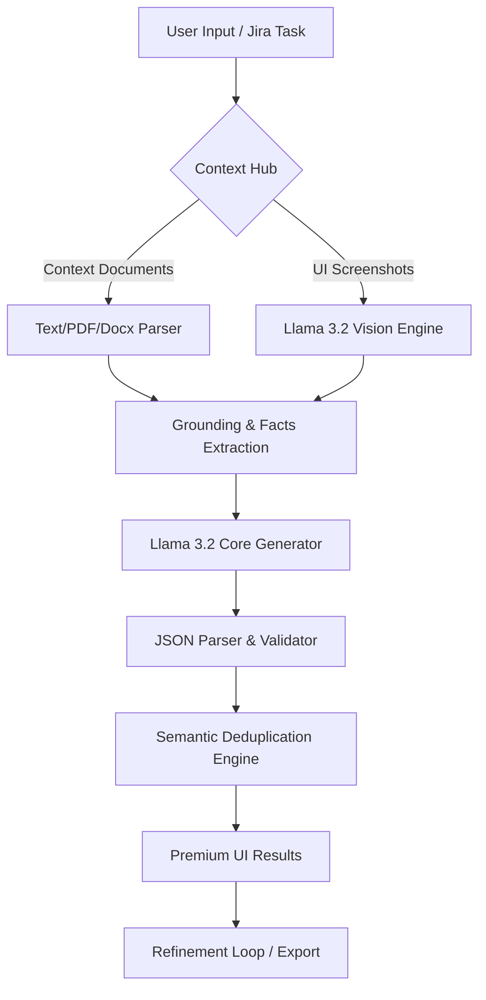

# 🚀 Local LLM Test Case Generator

A professional, privacy-first AI agent designed for QA engineers to generate, refine, and deduplicate high-quality test cases using local LLMs. Powered by **Ollama (Llama 3.2 & 3.2-Vision)** and **FastAPI**.


---

## 🛠️ Key Features

### 1. 🧠 Intelligent Test Generation
- **Jira-Aligned**: Generates detailed test scenarios directly from Jira task IDs and descriptions.
- **Multi-Context Processing**: Extract requirements from **PDFs, Word Docs (.docx), and Text files** automatically.
- **Anti-Hallucination**: High-precision grounding rules ensure test cases strictly follow your project context.

### 2. 📸 AI Vision Analysis (OCR & UI Recognition)
- **Screenshot context**: Attach UI screenshots or design mockups.
- **Live Vision Agent**: Uses `llama3.2-vision` to analyze UI elements, form fields, and workflows from your images to inform test case generation.

### 3. 🧩 Semantic Deduplication
- **Duplicate Detection**: Uses AI to scan your existing test case library and identify redundant scenarios during generation.
- **Side-by-Side Comparison**: Review duplicates with a similarity score and choose to Merge, Delete, or Keep.

### 4. 🎨 Premium & Elastic UI
- **Glassmorphism Design**: Sleek Dark Mode interface with interactive activity logs.
- **Collapsible Layout**: Flexible sidebars (Project & Refinement) allow you to expand the workspace for better visualization of complex test tables.
- **Auto-Expanding Input**: Natural writing experience with textareas that grow as you type.

---

## 📊 Project Workflow



---

## 🏗️ Technical Stack

-   **Backend**: Python, FastAPI, Uvicorn, Pydantic (Data Validation).
-   **AI Engine**: Ollama (Llama 3.2, Llama 3.2-Vision).
-   **Document Processing**: PyMuPDF (PDF), python-docx (Word).
-   **Frontend**: Vanilla JavaScript (ES6+), Modern CSS (Flex/Grid), HTML5.

---

## 🚀 Getting Started

### Prerequisites

-   **Python 3.9+**
-   **[Ollama](https://ollama.com/)** installed and running.
-   Pull the required models:
    ```bash
    ollama pull llama3.2
    ollama pull llama3.2-vision
    ```

### Installation

1.  **Clone the repository**:
    ```bash
    git clone https://github.com/yogeshcodeshare/AI_Project1-LocatTestCaseGenratorAgent.git
    cd AI_Project1-LocatTestCaseGenratorAgent
    ```

2.  **Set up Virtual Environment**:
    ```bash
    python3 -m venv venv
    source venv/bin/activate
    ```

3.  **Install Dependencies**:
    ```bash
    pip install -r requirements.txt
    ```

### 🏃‍♂️ Running the Hub

The easiest way to start is using the provided script:
```bash
./start.sh
```
This launches:
-   **Backend**: `http://localhost:8000`
-   **Frontend**: `http://localhost:8080`

---

## 📂 Project Structure

```text
├── backend/
│   ├── models.py        # Pydantic Schemas (Coercion & Validation)
│   ├── server.py        # FastAPI Endpoints
│   └── services/        # LLM Logic & Vision Processing
├── frontend/
│   ├── index.html       # Collapsible Sidebar UI
│   ├── app.js           # Frontend Logic & File Streams
│   └── style.css        # Premium Aesthetics (Glassmorphism)
├── architecture/        # Project logic definitions
├── .gitignore           # Ignored logs, venv, and local storage
└── requirements.txt     # Python dependencies
```

---

## 🤝 Contributing & Privacy

This project is built for **100% Data Sovereignty**. All processing happens on your local hardware. No data, files, or images are ever uploaded to an external server.

---
*Developed by Yogesh Mohite & Antigravity AI*
